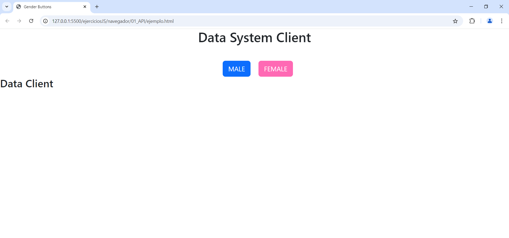
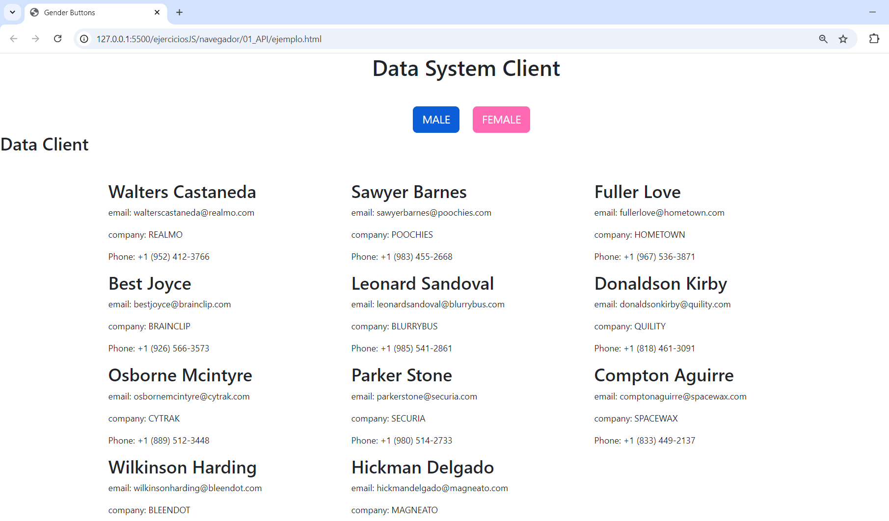

# Caso de estudio 

La empresa de seguros ARCD.SA necesita elaborar un programa de seguimiento de clientes importantes, para lo cual necesita un sistema de gestión de estos.

La información de los empleados se encuentra disponible en el siguiente enlace de esta API: https://alejandrochapi94.github.io/empleados/db_empleaados.json

A partir de estos datos se necesita elaborar lo siguiente:

Crear un sitio web que se conecte a la información de la API y permita mostrar por pantalla información de los clientes mediante dos botones, el primer botón "MALE" mostrará los nombres, email, compañía y número telefónico de todos los clientes con el dato "male" en la BBDD (desde la API). De igual manera mediante un botón llamado "FEMALE" mostrará los mismos datos pero de los clientes con los datos "Female" en la BBDD.

Como se puede ver en la siguiente imagen: 

Una vez se da clic en un botón la información se deberá mostrar en forma de lista como se puede ver en la siguiente captura:

Como ejemplo de lo que se espera puede revisar el siguiente enlace:

https://alejandrochapi94.github.io/empleados/JS/N_01_JSON_API+DOM/ejemplo.html