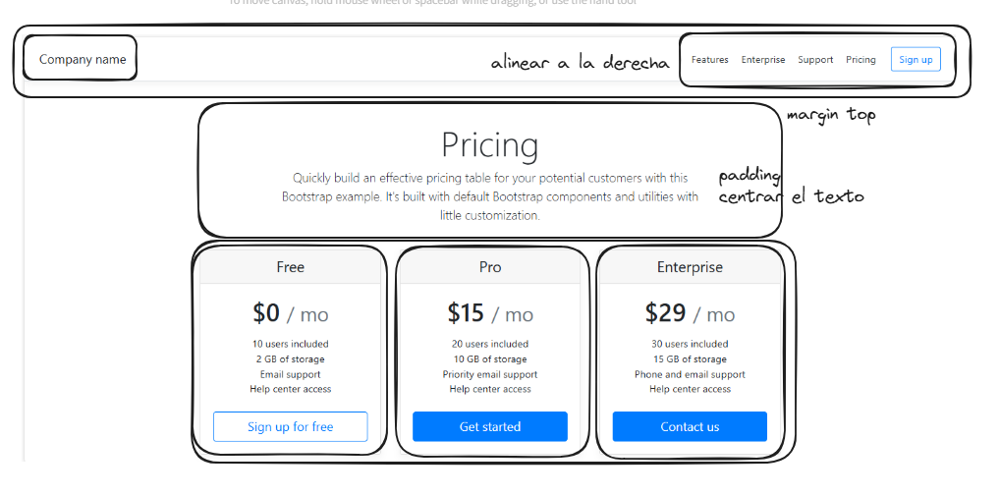

# Realizar el siguiente ejercicio para la práctica de bootstrap

Realizar el siguiente ejemplo usando bootstrap disponible en el siguiente enlace:

https://getbootstrap.com/docs/4.0/examples/pricing/

Importante, realizarlo solo usando contenedores como se les muestra en este ejemplo:

- Intentar que se parezca lo máximo posible a la forma normal.
- Aplicar los conceptos de los contendores y las columnas
- Aplicar los conceptos de los breakpoints para que se vuelva responsive de la misma forma en que se comporta el sitio web original.

Subir la tarea final al mismo repositorio.